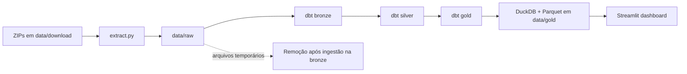

# Dados Reciclagem

Pipeline analítico local para identificar e catalogar empresas e estabelecimentos ligados à atividade de reciclagem a partir dos dados públicos do CNPJ.

## Visão geral

Este projeto transforma dados públicos do CNPJ em uma base analítica local, com foco em empresas e estabelecimentos ligados ao setor de reciclagem. O fluxo foi organizado em camadas para preservar a origem dos registros, padronizar as informações e disponibilizar uma visão analítica pronta para consulta.

A arquitetura implementada segue o caminho:

- extração de arquivos ZIP;
- armazenamento em raw;
- modelagem em bronze, silver e gold com dbt;
- materialização analítica em DuckDB e Parquet;
- consumo no dashboard em Streamlit.

## Objetivo do projeto

O objetivo principal é transformar arquivos brutos do cadastro empresarial em uma base analítica consistente e navegável, com foco em empresas e estabelecimentos vinculados ao setor de reciclagem. A partir disso, é possível:

- localizar estabelecimentos ativos por região, estado e município;
- segmentar empresas por porte e atividade econômica;
- filtrar registros relevantes por CNAE de reciclagem;
- apoiar decisões comerciais e estratégicas com base em dados públicos e estruturados.

## Arquitetura do pipeline



A solução combina Python, dbt, DuckDB e Streamlit em um fluxo em camadas:

- extração dos ZIPs para a pasta raw;
- leitura dos arquivos brutos no dbt;
- normalização e enriquecimento dos dados;
- remoção dos arquivos raw após a carga na bronze para reduzir uso de disco;
- consolidação analítica em gold;
- persistência em Parquet;
- consulta e exploração no dashboard.

## Fluxo de dados

1. Os arquivos compactados do CNPJ são armazenados em `data/download`.
2. O script `extract.py` extrai os ZIPs para `data/raw` e remove os arquivos compactados após a extração bem-sucedida.
3. Os modelos dbt carregam as fontes externas em DuckDB a partir dos arquivos raw.
4. A camada bronze ingere e seleciona os registros relevantes por CNAE.
5. Após a carga na bronze, os arquivos raw podem ser removidos para reduzir o uso de disco, já que são temporários e de grande volume.
6. A camada silver normaliza tipos, textos e atributos-chave.
7. A camada gold consolida a tabela analítica final com regras de negócio aplicadas.
8. O resultado é materializado em Parquet em `data/gold` e consumido pelo dashboard Streamlit.

## Camadas do projeto

### 1. Extração

O processo inicial acontece em `extract.py`. O script percorre a pasta `data/download`, identifica arquivos `.zip`, extrai o conteúdo para `data/raw` e remove os compactados após o processamento bem-sucedido.

### 2. Raw (temporária)

A camada raw preserva os arquivos originais do CNPJ em `data/raw` apenas como etapa temporária. Esses arquivos são temporários e têm finalidade de facilitar a ingestão inicial; após a carga bem-sucedida na camada bronze, eles podem ser removidos para economizar espaço em disco, dado o volume elevado dos dados públicos.

### 3. Bronze

Os modelos em `dbt_reciclagem/models/bronze/` realizam a leitura inicial dos dados da raw em DuckDB. A camada bronze preserva a estrutura dos arquivos de origem e prepara os registros para a etapa de transformação. A partir deste ponto, a base analítica passa a ficar consolidada nas camadas seguintes, e os arquivos raw podem ser descartados como artefatos temporários.

Modelos principais:
- `bronze_empresas.sql`
- `bronze_estabelecimentos.sql`
- `bronze_municipios.sql`

### 4. Silver

A camada silver executa a normalização e limpeza dos dados. Nesta etapa, campos como CNPJ, UF, CEP, município, porte e datas são convertidos e padronizados para garantir consistência analítica.

Modelos principais:
- `silver_empresas.sql`
- `silver_estabelecimentos.sql`
- `silver_municipios.sql`

### 5. Gold

A camada gold consolida a base analítica final em `dim_estabelecimentos`. O modelo une as informações de empresas, estabelecimentos e municípios, aplica regras de negócio e materializa a tabela analítica final em Parquet.

Arquivo principal:
- `dbt_reciclagem/models/gold/dim_estabelecimentos.sql`

### 6. Dashboard Streamlit

A aplicação em `dashboard/app.py` lê a dimensão final diretamente do Parquet por meio do DuckDB, utilizando `dashboard/data_utils.py`. A interface oferece filtros por região, UF, município e porte da empresa para consulta exploratória.

## Regras de negócio implementadas

A modelagem final incorpora as regras abaixo:

- filtro por CNAE de reciclagem: `cnae_fiscal_principal = '3832700'` ou `cnae_fiscal_secundaria = '3832700'`;
- manutenção apenas de estabelecimentos com `situacao_cadastral = 2`;
- uso de `coalesce(nome_fantasia, razao_social)` como nome da empresa;
- composição da chave do estabelecimento a partir de `cnpj_basico + cnpj_ordem + cnpj_dv`;
- exclusão de registros com `uf = 'EX'`;
- classificação regional por UF:
  - Norte: AC, AP, AM, PA, RO, RR, TO
  - Nordeste: AL, BA, CE, MA, PB, PE, PI, RN, SE
  - Centro-Oeste: DF, GO, MT, MS
  - Sudeste: ES, MG, RJ, SP
  - Sul: PR, RS, SC
- tradução do porte da empresa para rótulos legíveis:
  - `0` → `NÃO INFORMADO`
  - `1` → `MICRO EMPRESA`
  - `3` → `EMPRESA DE PEQUENO PORTE`
  - `5` → `DEMAIS`

## Estrutura do repositório

```text
.
├── dashboard/
│   ├── app.py
│   ├── data_utils.py
│   └── ui.py
├── data/
│   ├── download/
│   ├── raw/
│   ├── gold/
│   └── estab_reciclagem.duckdb
├── dbt_reciclagem/
│   ├── models/
│   │   ├── bronze/
│   │   ├── silver/
│   │   └── gold/
│   ├── dbt_project.yml
│   ├── profiles.yml
│   └── target/
├── extract.py
├── pyproject.toml
├── README.md
└── .gitignore
```

## Uso do dashboard

O painel disponibiliza uma visão analítica do catálogo de empresas de reciclagem, com filtros para:

- Região;
- Estado;
- Município;
- Porte da empresa.

A tabela final reúne os principais dados cadastrais e geográficos dos estabelecimentos relevantes, facilitando a exploração e a análise por localidade e perfil empresarial.

## Resultado

O projeto entrega um catálogo local de empresas e estabelecimentos de reciclagem, em base analítica organizada em camadas, com leitura eficiente em DuckDB/Parquet e interface visual em Streamlit para exploração por região, UF, município e porte da empresa.

## Próximos passos sugeridos

- adicionar gráficos de agregação por região e UF;
- incluir métricas temporais de evolução do mercado;
- incluir filtros adicionais por faixa de porte ou data de abertura;
- exportar dados filtrados em CSV ou Parquet;
- ampliar a base para outros segmentos do mercado de resíduos.
